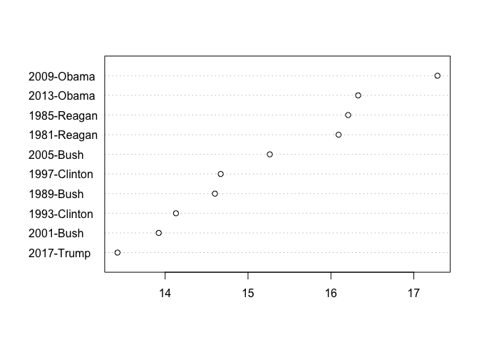
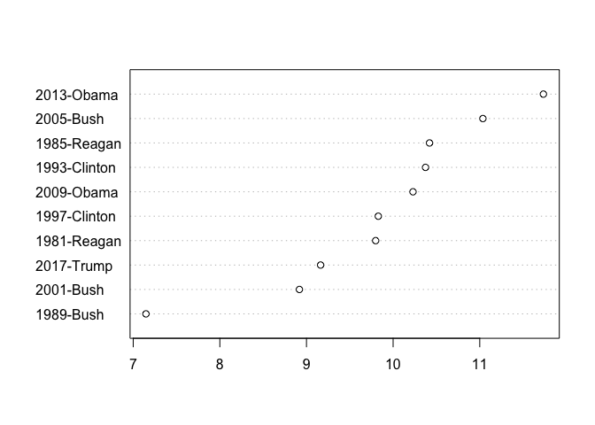
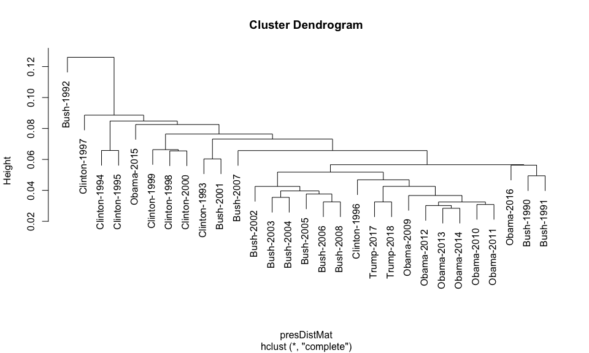
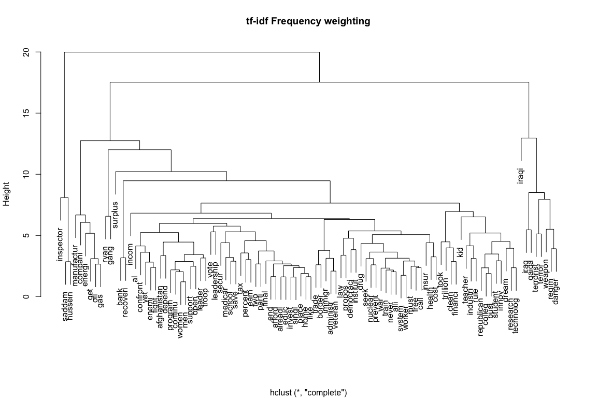

Descriptive Analysis of Texts
=============================

### Kenneth Benoit

### 24 April 2017

quateda has a number of descriptive statistics available for reporting on texts. The **simplest of these** is through the `summary()` method:

``` r
require(quanteda)
## Loading required package: quanteda
## quanteda version 0.9.9.51
## Using 7 of 8 cores for parallel computing
## 
## Attaching package: 'quanteda'
## The following object is masked from 'package:utils':
## 
##     View
txt <- c(sent1 = "This is an example of the summary method for character objects.",
         sent2 = "The cat in the hat swung the bat.")
summary(txt)
##    Text Types Tokens Sentences
## 1 sent1    12     12         1
## 2 sent2     8      9         1
```

This also works for corpus objects:

``` r
summary(corpus(data_char_ukimmig2010, notes = "Created as a demo."))
## Warning in corpus.character(data_char_ukimmig2010, notes = "Created as a
## demo."): Argument notes not used.
## Corpus consisting of 9 documents.
## 
##          Text Types Tokens Sentences
##           BNP  1126   3330        88
##     Coalition   144    268         4
##  Conservative   252    503        15
##        Greens   325    687        21
##        Labour   296    703        29
##        LibDem   257    499        14
##            PC    80    118         5
##           SNP    90    136         4
##          UKIP   346    739        27
## 
## Source:  /Users/kbenoit/GitHub/ITAUR/5_descriptive/* on x86_64 by kbenoit
## Created: Thu Apr 27 08:54:41 2017
## Notes:
```

To access the **syllables** of a text, we use `syllables()`:

``` r
nsyllable(c("Superman.", "supercalifragilisticexpialidocious", "The cat in the hat."))
## [1]  3 13  5
```

We can even compute the **Scabble value** of English words, using `scrabble()`:

``` r
nscrabble(c("cat", "quixotry", "zoo"))
## [1]  5 27 12
```

We can analyze the **lexical diversity** of texts, using `lexdiv()` on a dfm:

``` r
myDfm <- dfm(corpus_subset(data_corpus_inaugural, Year > 1980))
textstat_lexdiv(myDfm, "R")
##  1981-Reagan  1985-Reagan    1989-Bush 1993-Clinton 1997-Clinton 
##     61.23322     59.78702     62.53175     75.57121     65.42433 
##    2001-Bush    2005-Bush   2009-Obama   2013-Obama   2017-Trump 
##     76.13278     67.17373     62.00250     67.02974     79.45028
dotchart(sort(textstat_lexdiv(myDfm, "R")))
```



We can analyze the **readability** of texts, using `readability()` on a vector of texts or a corpus:

``` r
readab <- textstat_readability(corpus_subset(data_corpus_inaugural, Year > 1980), 
                               measure = "Flesch.Kincaid")
dotchart(sort(readab))
```



We can **identify documents and terms that are similar to one another**, using `similarity()`:

``` r
## Presidential Inaugural Address Corpus
require(magrittr)
## Loading required package: magrittr
presDfm <- corpus_subset(data_corpus_inaugural, Year > 1980) %>%
    dfm(remove = stopwords("english"), remove_punct = TRUE)
# compute some document similarities
textstat_simil(presDfm, "1985-Reagan")
##              1985-Reagan
## 1985-Reagan    1.0000000
## 1981-Reagan    0.6706669
## 1989-Bush      0.5470177
## 1993-Clinton   0.5651007
## 1997-Clinton   0.6385083
## 2001-Bush      0.4928258
## 2005-Bush      0.5021710
## 2009-Obama     0.5706274
## 2013-Obama     0.6216789
## 2017-Trump     0.4729232
textstat_simil(presDfm, c("2009-Obama", "2013-Obama"), method = "cosine")
##              2009-Obama 2013-Obama
## 2009-Obama    1.0000000  0.6759421
## 2013-Obama    0.6759421  1.0000000
## 1981-Reagan   0.6319046  0.6621948
## 1985-Reagan   0.6197507  0.6608769
## 1989-Bush     0.6217498  0.5883197
## 1993-Clinton  0.5984488  0.6035667
## 1997-Clinton  0.6696806  0.6571319
## 2001-Bush     0.6011057  0.6200375
## 2005-Bush     0.5165889  0.5728645
## 2017-Trump    0.5283706  0.5448031
textstat_dist(presDfm, c("2009-Obama", "2013-Obama"), method = "canberra")
##              2009-Obama 2013-Obama
## 2009-Obama        0.000   2594.270
## 2013-Obama     2594.270      0.000
## 1981-Reagan    2710.243   2710.183
## 1985-Reagan    2687.883   2694.700
## 1989-Bush      2718.337   2721.474
## 1993-Clinton   2662.772   2642.477
## 1997-Clinton   2656.768   2618.399
## 2001-Bush      2686.949   2600.678
## 2005-Bush      2663.364   2628.467
## 2017-Trump     2732.926   2712.234
textstat_dist(presDfm, c("2009-Obama", "2013-Obama"), method = "eJaccard")
##              2009-Obama 2013-Obama
## 2009-Obama    1.0000000  0.5104122
## 2013-Obama    0.5104122  1.0000000
## 1981-Reagan   0.4562050  0.4871888
## 1985-Reagan   0.4370275  0.4777219
## 1989-Bush     0.4497932  0.4148976
## 1993-Clinton  0.4234883  0.4296230
## 1997-Clinton  0.4769717  0.4609940
## 2001-Bush     0.4204939  0.4412115
## 2005-Bush     0.3474591  0.3998888
## 2017-Trump    0.3589839  0.3741432

# compute some term similarities
lapply(as.list(textstat_simil(presDfm, c("fair", "health", "terror"), margin = "features", method = "cosine")), head, n = 10)
## $fair
##      size  economic       tax beginning  national   economy  republic 
## 0.9045340 0.8922269 0.8869686 0.8864053 0.8775269 0.8775269 0.8703883 
##    months       god    create 
## 0.8703883 0.8703883 0.8616404 
## 
## $health
##       wrong      reform      common   knowledge      planet generations 
##   0.8944272   0.8944272   0.8888889   0.8888889   0.8819171   0.8728716 
##      ideals        true     without        long 
##   0.8540168   0.8432740   0.8432740   0.8399211 
## 
## $terror
##        full     sustain       solve        land commonplace      denied 
##   0.9428090   0.9128709   0.9128709   0.8876254   0.8660254   0.8660254 
##   guarantee     problem      racial      bounty 
##   0.8660254   0.8660254   0.8660254   0.8660254
```

And this can be used for **clustering documents**:

``` r
data(data_corpus_SOTU, package="quantedaData")
presDfm <- dfm(subset(data_corpus_SOTU, lubridate::year(Date)>1990), stem = TRUE,
               remove = stopwords("english"))
## Warning: 'subset.corpus' is deprecated.
## Use 'corpus_subset' instead.
## See help("Deprecated")
presDfm <- dfm_trim(presDfm, min_count = 5, min_docfreq = 3)
# hierarchical clustering - get distances on normalized dfm
presDistMat <- dist(as.matrix(dfm_weight(presDfm, "relFreq")))
# hiarchical clustering the distance object
presCluster <- hclust(presDistMat)
# label with document names
presCluster$labels <- docnames(presDfm)
# plot as a dendrogram
plot(presCluster)
```



Or we could look at **term clustering** instead:

``` r
# word dendrogram with tf-idf weighting
wordDfm <- sort(dfm_weight(presDfm, "tfidf"))
## Warning: 'sort.dfm' is deprecated.
## Use 'dfm_sort' instead.
## See help("Deprecated")
wordDfm <- t(wordDfm)[1:100,]  # because transposed
wordDistMat <- dist(wordDfm)
wordCluster <- hclust(wordDistMat)
plot(wordCluster, xlab="", main="tf-idf Frequency weighting")
```



Finally, there are number of helper functions to extract information from quanteda objects:

``` r
myCorpus <- corpus_subset(data_corpus_inaugural, Year > 1980)

# return the number of documents
ndoc(myCorpus)           
```

    ## [1] 10

``` r
ndoc(dfm(myCorpus, verbose = FALSE))
```

    ## [1] 10

``` r
# how many tokens (total words)
ntoken(myCorpus)
```

    ##  1981-Reagan  1985-Reagan    1989-Bush 1993-Clinton 1997-Clinton 
    ##         2798         2935         2683         1837         2451 
    ##    2001-Bush    2005-Bush   2009-Obama   2013-Obama   2017-Trump 
    ##         1810         2325         2729         2335         1662

``` r
ntoken("How many words in this sentence?")
```

    ## [1] 7

``` r
# arguments to tokenize can be passed 
ntoken("How many words in this sentence?", remove_punct = TRUE)
```

    ## [1] 6

``` r
# how many types (unique words)
ntype(myCorpus)
```

    ##  1981-Reagan  1985-Reagan    1989-Bush 1993-Clinton 1997-Clinton 
    ##          904          925          795          644          773 
    ##    2001-Bush    2005-Bush   2009-Obama   2013-Obama   2017-Trump 
    ##          622          772          939          814          582

``` r
ntype("Yada yada yada.  (TADA.)")
```

    ## [1] 6

``` r
ntype("Yada yada yada.  (TADA.)", remove_punct = TRUE)
```

    ## [1] 3

``` r
ntype(char_tolower("Yada yada yada.  (TADA.)"), remove_punct = TRUE)
```

    ## [1] 2

``` r
# can count documents and features
ndoc(data_corpus_inaugural)
```

    ## [1] 58

``` r
myDfm1 <- dfm(data_corpus_inaugural)
ndoc(myDfm1)
```

    ## [1] 58

``` r
nfeature(myDfm1)
```

    ## [1] 9232

``` r
myDfm2 <- dfm(data_corpus_inaugural, remove = stopwords("english"), stem = TRUE)
nfeature(myDfm2)
```

    ## [1] 5289

``` r
myDfm3 <- dfm(data_corpus_inaugural, remove = stopwords("english"), remove_punct = TRUE, stem = TRUE)
nfeature(myDfm3)
```

    ## [1] 5405

``` r
# can extract feature labels and document names
head(featnames(myDfm1), 20)
```

    ##  [1] "fellow"          "-"               "citizens"       
    ##  [4] "of"              "the"             "senate"         
    ##  [7] "and"             "house"           "representatives"
    ## [10] ":"               "among"           "vicissitudes"   
    ## [13] "incident"        "to"              "life"           
    ## [16] "no"              "event"           "could"          
    ## [19] "have"            "filled"

``` r
head(docnames(myDfm1))
```

    ## [1] "1789-Washington" "1793-Washington" "1797-Adams"      "1801-Jefferson" 
    ## [5] "1805-Jefferson"  "1809-Madison"

``` r
# and topfeatures
topfeatures(myDfm1)
```

    ##   the    of     ,   and     .    to    in     a   our  that 
    ## 10082  7103  7026  5310  4945  4534  2785  2246  2181  1789

``` r
topfeatures(myDfm2) # without stopwords
```

    ##      ,      .      -   will govern nation  peopl      ;     us    can 
    ##   7026   4945   1042    931    687    677    623    565    478    471

``` r
topfeatures(myDfm3) # without stopwords or punctuation
```

    ##   will nation govern  peopl     us    can  state  great   upon  power 
    ##    931    675    657    623    478    471    450    373    371    370
