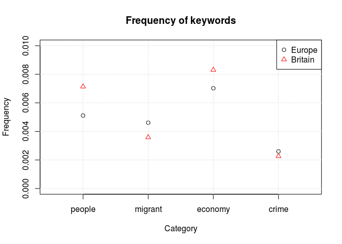

Analyzing Media Text
====================

### Kohei Watanabe

### 24 April 2017

### Overview

This section explains specific techniques useful in analyzing news articles:

-   Constructing subject specific `tokens` object using `kwic`
-   Identifying and concatenating multi-word expressions using `textstat_collocations()`

### Characteristics of news articles/transcripts

It is common to construct a corpus of news articles (or transcripts) from databases with keyword queries, but such a corpus still contains a lot of noises, because a news article is a set sentences and paragraphs on various subjects. To focus our analysis on particular subjects, we can construct a `tokens` by `kwic()`.

1.  Construct a `tokens` as usual from a corpus
2.  Run `kwic()` on the `tokens` to create a `kwic`
3.  Convert `kiwc` into `tokens` using `as.tokens`
4.  Apply whatever analysis we want on `tokens`

### Constructing tokens from kwic

``` r
require(quanteda)
## Loading required package: quanteda
## quanteda version 0.9.9.51
## Using 3 of 4 cores for parallel computing
## 
## Attaching package: 'quanteda'
## The following object is masked from 'package:utils':
## 
##     View
load('guardianSample.RData')
toks <- tokens(guardianSample, remove_punct = TRUE)
toks <- tokens_remove(toks, stopwords('english'))

europe <- kwic(toks, c('Europe*', 'European Union', 'EU'))
head(europe)
##                                                                   
##  [text166545, 130:130]    Sunday master's degree Russian Eastern |
##  [text166549, 464:465]      also agnostic possibility UK leaving |
##  [text166551, 130:130]    Sunday master's degree Russian Eastern |
##  [text166552, 346:346]     protests human rights groups scrutiny |
##  [text166552, 417:417]       LGBTI people least legal protection |
##  [text166556, 231:231] attending Bilderberg 2016 senior director |
##                                                             
##     European    | Eurasian studies rather making campus     
##  European Union | refused say whether potential Brexit      
##     European    | Eurasian studies rather making campus     
##     European    | bodies Last month government scrapped     
##        EU       | activists say impression attacks increased
##     European    | affairs Aspen Institute sounds awful

britain <- kwic(toks, c('Brit*', 'United Kingdom', 'UK'))
head(britain)
##                                                                    
##  [text166549, 462]         said Johnson also agnostic possibility |
##  [text166549, 474]                potential Brexit hurt US assume |
##  [text166549, 493]      condemned Barack Obama's presumption urge |
##  [text166549, 501]         far removed decision-making will occur |
##    [text166557, 4]                      German government written |
##   [text166557, 15] undercover policing extended covert operations |
##                                                  
##    UK    | leaving European Union refused say    
##  Britain | acting best interests best interests  
##    UK    | exit think far removed decision-making
##  Britain | said                                  
##  British | Home Office asking Pitchford inquiry  
##  British | police Germany inquiry set following

toks_europe <- as.tokens(europe)
toks_britain <- as.tokens(britain)
```

### Relative frequency analysis

`r dfm_europe <- dfm(toks_europe) dfm_britain <- dfm(toks_britain) kwds <- textstat_keyness(rbind(dfm_europe, dfm_britain), target = seq_along(toks_europe)) ##`

``` r
head(kwds, 20)
##                   chi2            p n_target n_reference
## eu          4447.06047 0.000000e+00    12582        3928
## european    1996.36973 0.000000e+00     4496        1089
## europe      1457.13635 0.000000e+00     3346         825
## referendum   379.84838 0.000000e+00     1826         789
## union        277.24969 0.000000e+00     1387         611
## uk's         197.99186 0.000000e+00      379          72
## leaving      195.84856 0.000000e+00      948         410
## commission   138.60193 0.000000e+00      381         111
## countries    125.25612 0.000000e+00      570         238
## membership   108.77832 0.000000e+00      604         279
## member       107.82008 0.000000e+00      488         203
## eastern      106.47144 0.000000e+00      173          24
## turkey       105.47387 0.000000e+00      230          52
## leave         93.94419 0.000000e+00     1838        1250
## council       89.82983 0.000000e+00      301         103
## europe's      79.60511 0.000000e+00      227          68
## europeans     77.59604 0.000000e+00      173          40
## leaders       71.19139 0.000000e+00      483         243
## jean-claude   69.10303 1.110223e-16      131          24
## president     67.08518 2.220446e-16      316         134
tail(kwds, 20)
##                   chi2            p n_target n_reference
## great        -48.21270 3.824052e-12      167         312
## retail       -49.74940 1.746936e-12        8          70
## shouted      -50.63190 1.114220e-12        3          59
## brits        -51.92031 5.779821e-13       20          97
## people       -53.02230 3.297362e-13      729        1004
## recession    -57.54266 3.308465e-14       30         122
## virgin       -62.33120 2.886580e-15        4          73
## overseas     -62.36831 2.886580e-15       26         120
## shouting     -66.19302 4.440892e-16        0          66
## kingdom      -69.97253 1.110223e-16       85         229
## britons      -70.30955 0.000000e+00       97         248
## rating       -75.91746 0.000000e+00        2          81
## companies    -83.94704 0.000000e+00       60         206
## tax          -86.51522 0.000000e+00       42         177
## government  -108.52908 0.000000e+00      365         686
## first       -137.02528 0.000000e+00      193         488
## britain's   -444.43734 0.000000e+00      604        1544
## britain    -1445.45047 0.000000e+00     2076        5162
## british    -2146.20604 0.000000e+00      703        3682
## uk         -3496.19987 0.000000e+00     2375        8198
```

### Targetted dictionary analysis

``` r
dict <- dictionary(people = c('people', 'citizen*'), 
                   migrant = c('immigra*', 'migra*'),
                   economy = c('econom*', 'financ*', 'business*'),
                   crime = c('crim*', 'polic*', 'terror*'))

dfm_dict_europe <- dfm(toks_europe, dictionary = dict)
dfm_dict_britain <- dfm(toks_britain, dictionary = dict)

freq_dict_europe <- colSums(dfm_dict_europe) / sum(ntoken(toks_europe))
freq_dict_britain <- colSums(dfm_dict_britain) / sum(ntoken(toks_britain))


plot(freq_dict_europe, ylab = 'Frequency', xlab = 'Category', xaxt = 'n', 
     ylim = c(0, 0.01), xlim = c(0.5, 4.5), main = "Frequency of keywords")
axis(1, at = 1:4, labels = names(freq_dict_europe))
grid()
points(freq_dict_britain, col = 'red', pch = 2)
legend('topright', legend = c('Europe', 'Britain'), col = c('black', 'red'), pch = 1:2)
```



### Identifying and concatenating multi-word expressions

``` r
require(quanteda)
load('guardianSample.RData')
toks <- tokens(guardianSample, remove_punct = FALSE)
toks <- tokens_remove(toks, stopwords('english'), padding = TRUE)
col <- textstat_collocations(toks, method = 'bj', max_size = 5,
                             features = "^[A-Z][A-Za-z0-9]+$", valuetype = "regex", case_insensitive = FALSE)
head(col)
##      collocation   lambda       sigma count         z p
## 1  David Cameron 41.92164 0.002046910  1170 20480.452 0
## 2 European Union 40.42832 0.003910510  1137 10338.374 0
## 3       New York 39.17706 0.004465956   696  8772.379 0
## 4   Michael Gove 38.27874 0.004369808   417  8759.822 0
## 5    White House 37.95508 0.005670581   473  6693.331 0
## 6  Boris Johnson 38.56260 0.005950435   677  6480.636 0
toks_multi <- tokens_compound(toks, col)
head(toks[['text166563']], 50)
##  [1] "Scottish"     "voters"       "hoping"       ""            
##  [5] ""             "vote"         ""             "leave"       
##  [9] ""             "European"     "Union"        ""            
## [13] "spark"        ""             "second"       "independence"
## [17] "referendum"   ""             "first"        "consider"    
## [21] ""             "\""           "solidarity"   ""            
## [25] "people"       "across"       ""             "continent"   
## [29] "\""           ","            "Jeremy"       "Corbyn"      
## [33] ""             "suggested"    "."            "|"           
## [37] ""             "SNP"          "leader"       ""            
## [41] "Scottish"     "first"        "minister"     ","           
## [45] "Nicola"       "Sturgeon"     ","            ""            
## [49] "repeatedly"   "said"
head(toks_multi[['text166563']], 50)
##  [1] "Scottish"        "voters"          "hoping"         
##  [4] ""                ""                "vote"           
##  [7] ""                "leave"           ""               
## [10] "European_Union"  ""                "spark"          
## [13] ""                "second"          "independence"   
## [16] "referendum"      ""                "first"          
## [19] "consider"        ""                "\""             
## [22] "solidarity"      ""                "people"         
## [25] "across"          ""                "continent"      
## [28] "\""              ","               "Jeremy_Corbyn"  
## [31] ""                "suggested"       "."              
## [34] "|"               ""                "SNP"            
## [37] "leader"          ""                "Scottish"       
## [40] "first"           "minister"        ","              
## [43] "Nicola_Sturgeon" ","               ""               
## [46] "repeatedly"      "said"            ""               
## [49] ""                "vote"
```
