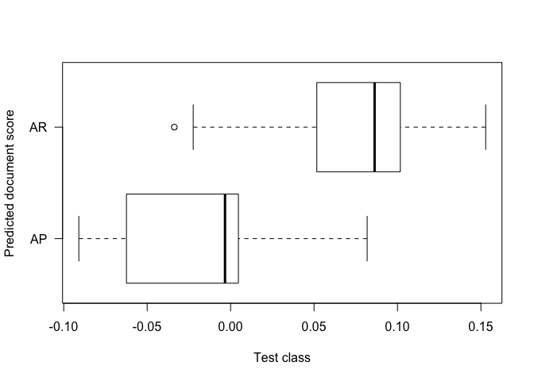
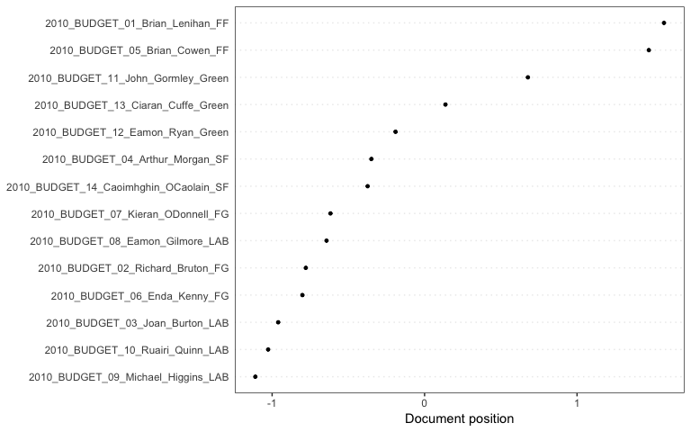
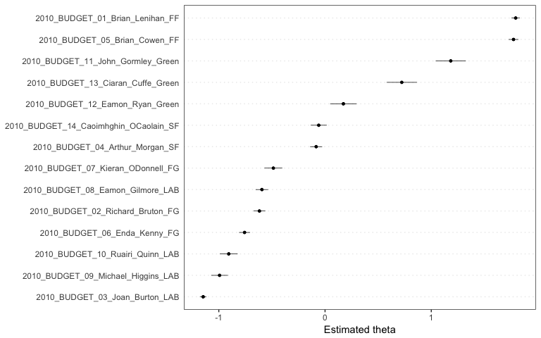

Advanced Analysis of Texts
==========================

### Kenneth Benoit

### 24 April 2017

In this section we will explore some text analysis and analysis of metadata from a corpus of tweets retrieved from the Twitter API. The tweets are a small sample from a collection of tweets relating to the European Parliament elections of 2015.

Load the data frame containing the sample tweets:

``` r
require(quanteda)
## Loading required package: quanteda
## quanteda version 0.9.9.51
## Using 7 of 8 cores for parallel computing
## 
## Attaching package: 'quanteda'
## The following object is masked from 'package:utils':
## 
##     View
load("tweetSample.RData")
str(tweetSample)
## 'data.frame':    10000 obs. of  35 variables:
##  $ created_at          : chr  "2014-05-28 15:53:33+00:00" "2014-05-30 08:32:13+00:00" "2014-05-29 19:22:15+00:00" "2014-05-03 20:23:43+00:00" ...
##  $ geo_latitude        : num  NA NA NA NA NA NA NA NA NA NA ...
##  $ geo_longitude       : num  NA NA NA NA NA NA NA NA NA NA ...
##  $ hashtags            : chr  "['Pomeriggio5', 'Canale5']" NA NA NA ...
##  $ id                  : num  4.72e+17 4.72e+17 4.72e+17 4.63e+17 4.71e+17 ...
##  $ lang                : Factor w/ 43 levels "Arabic","Basque",..: 20 35 35 15 30 12 33 9 35 35 ...
##  $ text                : chr  "Oggi pomeriggio, a partire dalle 18.00, interverrò a #Pomeriggio5 su #Canale5 http://t.co/aqB64fH4et ST" ".@pacomarhuenda llamando El Coletas a @Pablo_Iglesias_... precisamente, si hay alguien que tiene que callarse sobre peinados, e"| __truncated__ "Las declaraciones de Felipe Gonzalez hoy hablan por sí solas http://t.co/0LJo6zAXdc" "@KOPRITHS @GAPATZHS @MariaSpyraki και εκεί που λες εχουν πιάσει πάτο, θα καταφέρουν να σε διαψεύσουν." ...
##  $ type                : Factor w/ 3 levels "reply","retweet",..: 2 3 2 2 3 2 2 2 2 2 ...
##  $ user_followers_count: int  769 303 470 470 3662 470 67 124 1359 181 ...
##  $ user_friends_count  : int  557 789 419 647 793 910 36 90 793 258 ...
##  $ user_geo_enabled    : Factor w/ 2 levels "False","True": 1 1 2 1 2 1 2 1 1 2 ...
##  $ user_id             : num  8.40e+07 2.75e+08 4.61e+08 2.43e+09 1.62e+08 ...
##  $ user_id_str         : num  8.40e+07 2.75e+08 4.61e+08 2.43e+09 1.62e+08 ...
##  $ user_lang           : Factor w/ 40 levels "Arabic","Basque",..: 10 34 34 16 4 13 21 10 4 34 ...
##  $ user_listed_count   : int  6 13 1 1 133 4 0 3 31 7 ...
##  $ user_location       : chr  NA "Sanfer of Henares" "La Puebla ciry" NA ...
##  $ user_name           : chr  "Francesco Filini" "Carlos Marina" "Gabi Armario Cívico" "ΤΗΛΕΠΛΑΣΙΕ" ...
##  $ user_screen_name    : chr  "FrancescoFilini" "marina_carlos" "erpartecama" "THLEPLASHIE" ...
##  $ user_statuses_count : int  1880 7051 6776 666 19006 30239 1563 601 37237 2313 ...
##  $ user_time_zone      : chr  "Amsterdam" "Madrid" "Athens" NA ...
##  $ user_url            : chr  "http://rapportoaureo.wordpress.com" "http://carlosmarina.com" "http://www.cazuelaalamorisca.com" NA ...
##  $ user_created_at     : chr  "Wed, 21 Oct 2009 08:59:58 +0000" "2011-03-30 13:07:21+00:00" "Tue, 10 Jan 2012 23:23:18 +0000" "Mon, 07 Apr 2014 10:59:39 +0000" ...
##  $ user_geo_enabled.1  : Factor w/ 2 levels "False","True": 1 1 2 1 2 1 2 1 1 2 ...
##  $ user_screen_nameL   : chr  "francescofilini" "marina_carlos" "erpartecama" "thleplashie" ...
##  $ Party               : chr  NA NA NA NA ...
##  $ Party.Code          : num  NA NA NA NA NA NA NA NA NA NA ...
##  $ Sitting_2009        : Factor w/ 2 levels "Non-incumbent",..: NA NA NA NA NA NA NA NA NA NA ...
##  $ Sitting_2014        : Factor w/ 2 levels "Non-incumbent",..: NA NA NA NA NA NA NA NA NA NA ...
##  $ Name                : chr  NA NA NA NA ...
##  $ Twitter             : chr  NA NA NA NA ...
##  $ Facebook            : chr  NA NA NA NA ...
##  $ gender              : Factor w/ 2 levels "Female","Male": NA NA NA NA NA NA NA NA NA NA ...
##  $ Country             : Factor w/ 27 levels "Austria","Belgium",..: NA NA NA NA NA NA NA NA NA NA ...
##  $ hasTwitter          : Factor w/ 2 levels "No","Yes": NA NA NA NA NA NA NA NA NA NA ...
##  $ candidate           : Factor w/ 2 levels "candidate","non-candidate": NA NA NA NA NA NA NA NA NA NA ...
```

``` r
require(lubridate)
## Loading required package: lubridate
## 
## Attaching package: 'lubridate'
## The following object is masked from 'package:base':
## 
##     date
require(dplyr)
## Loading required package: dplyr
## 
## Attaching package: 'dplyr'
## The following objects are masked from 'package:lubridate':
## 
##     intersect, setdiff, union
## The following objects are masked from 'package:stats':
## 
##     filter, lag
## The following objects are masked from 'package:base':
## 
##     intersect, setdiff, setequal, union
tweetSample <- mutate(tweetSample, day = yday(created_at))
tweetSample <- mutate(tweetSample, dayDate = as.Date(day-1, origin = "2014-01-01"))
juncker <- filter(tweetSample, grepl('juncker', text, ignore.case = TRUE)) %>% 
    mutate(kand = 'Juncker')
schulz <-  filter(tweetSample, grepl('schulz', text, ignore.case = TRUE)) %>% 
    mutate(kand = 'Schulz')
verhof <-  filter(tweetSample, grepl('verhofstadt', text, ignore.case = TRUE)) %>% 
    mutate(kand = 'Verhofstadt')
spitzAll <- bind_rows(juncker, schulz, verhof)
```

Once the data is in the correct format, we can use ggplot to display the candidate mentions on the a single plot:

``` r
require(ggplot2)
## Loading required package: ggplot2
require(scales)
## Loading required package: scales
# mentioning kandidates names over time
plotDf <- count(spitzAll, kand, day=day) %>% 
    mutate(day = as.Date(day-1, origin = "2014-01-01"))

ggplot(data=plotDf, aes(x=day, y=n, colour=kand)) + 
    geom_line(size=1) +
    scale_y_continuous(labels = comma) + geom_vline(xintercept=as.numeric(as.Date("2014-05-15")), linetype=4) +
    geom_vline(xintercept=as.numeric(as.Date("2014-05-25")), linetype=4) +
    theme(axis.text=element_text(size=12),
          axis.title=element_text(size=14,face="bold"))
```


We can use the `keptFeatures` argument to `dfm()` to analyse only hashtags for each candidate's text.

``` r
# Top hashtags for tweets that mention Juncker
dv <- data.frame(user = juncker$user_screen_name)
jCorp <- corpus(juncker$text, docvars = dv)
jd <- dfm(jCorp)
jd <- dfm_select(jd, "^#.+", "keep", valuetype = "regex") 
# equivalent: jd <- dfm_select(jd, "#*", "keep", valuetype = "glob") 
topfeatures(jd, nfeature(jd))
##   #withjuncker    #telleurope     #nowschulz        #ep2014  #eudebate2014 
##              0              0              0              0              0 
##            #rt        #ee2014           #afd          #riga   #teammartens 
##              0              0              0              0              0 
##       #tvduell        #eu2014  #caraacaratve           #ppe        #votapp 
##              0              0              0              0              0 
##    #votacanete #publicviewing     #tvduell's        #euhaus          #eu14 
##              0              0              0              0              0 
##    #europawahl        #berlin         #linke        #merkel       #gabriel 
##              0              0              0              0              0 
##     #wahlarena 
##              0
```

Further analysis examples
-------------------------

Wordscores:

``` r
data(data_corpus_amicus, package = "quantedaData")
refs <- docvars(data_corpus_amicus, "trainclass")
refs <- (as.numeric(refs) - 1.5)*2
amicusDfm <- dfm(data_corpus_amicus)
wm <- textmodel_wordscores(amicusDfm, y = refs)
summary(wm)
## Call:
##  textmodel_wordscores(x = amicusDfm, y = refs)
## 
## Reference Document Statistics:
## (ref scores and feature count statistics)
## 
##           Score Total Min  Max       Mean Median
## sP1.txt      -1 14124   0  973 0.69855087      0
## sP2.txt      -1 16001   0  983 0.79138434      0
## sR1.txt       1 16432   0 1040 0.81270092      0
## sR2.txt       1 14713   0  838 0.72768188      0
## sAP01.txt    NA  7935   0  409 0.39245264      0
## sAP02.txt    NA  8629   0  560 0.42677679      0
## sAP03.txt    NA 10241   0  620 0.50650378      0
## sAP04.txt    NA  6253   0  395 0.30926356      0
## sAP05.txt    NA  9345   0  572 0.46218903      0
## sAP06.txt    NA  6446   0  339 0.31880904      0
## sAP07.txt    NA  6039   0  360 0.29867946      0
## sAP08.txt    NA  2132   0  121 0.10544537      0
## sAP09.txt    NA  5757   0  305 0.28473218      0
## sAP10.txt    NA  5382   0  317 0.26618527      0
## sAP11.txt    NA  7784   0  439 0.38498442      0
## sAP12.txt    NA  9397   0  554 0.46476087      0
## sAP13.txt    NA  7055   0  468 0.34892922      0
## sAP14.txt    NA  8031   0  496 0.39720065      0
## sAP15.txt    NA  8017   0  451 0.39650823      0
## sAP16.txt    NA  4968   0  280 0.24570948      0
## sAP17.txt    NA  6710   0  380 0.33186607      0
## sAP18.txt    NA  5202   0  257 0.25728275      0
## sAP19.txt    NA  4404   0  285 0.21781493      0
## sAR01.txt    NA  2737   0  168 0.13536772      0
## sAR02.txt    NA 10062   0  718 0.49765072      0
## sAR03.txt    NA  9671   0  635 0.47831248      0
## sAR04.txt    NA  9836   0  518 0.48647312      0
## sAR05.txt    NA  9566   0  667 0.47311934      0
## sAR06.txt    NA 11637   0  813 0.57554775      0
## sAR07.txt    NA 10693   0  580 0.52885899      0
## sAR08.txt    NA  8757   0  570 0.43310747      0
## sAR09.txt    NA  6991   0  410 0.34576389      0
## sAR10.txt    NA 10504   0  697 0.51951135      0
## sAR11.txt    NA 10966   0  611 0.54236115      0
## sAR12.txt    NA  5024   0  275 0.24847915      0
## sAR13.txt    NA 10675   0  717 0.52796874      0
## sAR14.txt    NA  7622   0  466 0.37697215      0
## sAR15.txt    NA 10459   0  568 0.51728572      0
## sAR16.txt    NA  8579   0  548 0.42430387      0
## sAR17.txt    NA  9294   0  567 0.45966665      0
## sAR18.txt    NA 10041   0  607 0.49661210      0
## sAR19.txt    NA  6428   0  362 0.31791879      0
## sAR20.txt    NA 11391   0  775 0.56338098      0
## sAR21.txt    NA  6391   0  424 0.31608883      0
## sAR22.txt    NA  9567   0  565 0.47316880      0
## sAR23.txt    NA  8966   0  527 0.44344429      0
## sAR24.txt    NA  9973   0  567 0.49324892      0
## sAR25.txt    NA  8710   0  451 0.43078293      0
## sAR26.txt    NA 10354   0  583 0.51209259      0
## sAR27.txt    NA 10169   0  559 0.50294278      0
## sAR28.txt    NA  7295   0  392 0.36079925      0
## sAR29.txt    NA 10325   0  656 0.51065829      0
## sAR30.txt    NA  8099   0  598 0.40056383      0
## sAR31.txt    NA  9088   0  634 0.44947821      0
## sAR32.txt    NA  9418   0  632 0.46579950      0
## sAR33.txt    NA 10437   0  537 0.51619764      0
## sAR34.txt    NA  8224   0  456 0.40674613      0
## sAR35.txt    NA  9191   0  530 0.45457243      0
## sAR36.txt    NA  2765   0  154 0.13675256      0
## sAR37.txt    NA  8157   0  497 0.40343242      0
## sAR38.txt    NA  8403   0  435 0.41559919      0
## sAR39.txt    NA  8673   0  453 0.42895297      0
## sAR40.txt    NA 10235   0  538 0.50620703      0
## sAR41.txt    NA  8960   0  518 0.44314753      0
## sAR42.txt    NA  3103   0  219 0.15346951      0
## sAR43.txt    NA  8666   0  420 0.42860676      0
## sAR44.txt    NA 12029   0  680 0.59493546      0
## sAR45.txt    NA  9527   0  592 0.47119046      0
## sAR46.txt    NA 10580   0  606 0.52327019      0
## sAR47.txt    NA  2292   0  116 0.11335872      0
## sAR48.txt    NA  5311   0  264 0.26267372      0
## sAR49.txt    NA  8541   0  451 0.42242445      0
## sAR50.txt    NA  8390   0  452 0.41495623      0
## sAR51.txt    NA  4156   0  233 0.20554924      0
## sAR52.txt    NA  9712   0  562 0.48034027      0
## sAR53.txt    NA  5389   0  344 0.26653148      0
## sAR54.txt    NA 10684   0  692 0.52841387      0
## sAR55.txt    NA   240   0   17 0.01187002      0
## sAR56.txt    NA  9584   0  563 0.47400959      0
## sAR58.txt    NA  4983   0  379 0.24645136      0
## sAR59.txt    NA  6853   0  411 0.33893862      0
## sAR60.txt    NA  8178   0  446 0.40447104      0
## sAR61.txt    NA  7354   0  526 0.36371730      0
## sAR62.txt    NA  4868   0  290 0.24076364      0
## sAR63.txt    NA  5578   0  284 0.27587912      0
## sAR64.txt    NA 10664   0  623 0.52742470      0
## sAR65.txt    NA 10948   0  617 0.54147089      0
## sAR66.txt    NA  8275   0  474 0.40926851      0
## sAR67.txt    NA  6104   0  308 0.30189426      0
## sAR68.txt    NA  7791   0  452 0.38533063      0
## sAR71.txt    NA  9730   0  595 0.48123053      0
## sAR72.txt    NA  7678   0  516 0.37974183      0
## sAR73.txt    NA  8756   0  453 0.43305801      0
## sAR74.txt    NA  3688   0  213 0.18240269      0
## sAR75.txt    NA  7746   0  502 0.38310500      0
## sAR76.txt    NA  6110   0  404 0.30219101      0
## sAR77.txt    NA  5462   0  307 0.27014195      0
## sAR78.txt    NA  3117   0  193 0.15416193      0
## sAR79.txt    NA  5361   0  281 0.26514664      0
## sAR80.txt    NA  7497   0  572 0.37078985      0
## sAR81.txt    NA  2770   0  128 0.13699985      0
## sAR83.txt    NA  6181   0  349 0.30570256      0
preds <- predict(wm, newdata = amicusDfm)
summary(preds)
## Predicted textmodel of type: wordscores
## 
##           textscore LBG se   ci lo   ci hi
## sP1.txt     -0.2020 0.0030 -0.2079 -0.1960
## sP2.txt     -0.1837 0.0029 -0.1893 -0.1780
## sR1.txt      0.2277 0.0033  0.2212  0.2342
## sR2.txt      0.1579 0.0034  0.1512  0.1647
## sAP01.txt   -0.0595 0.0047 -0.0687 -0.0504
## sAP02.txt    0.0024 0.0045 -0.0063  0.0111
## sAP03.txt   -0.0015 0.0042 -0.0097  0.0067
## sAP04.txt   -0.0910 0.0049 -0.1006 -0.0813
## sAP05.txt    0.0070 0.0044 -0.0017  0.0157
## sAP06.txt   -0.0653 0.0050 -0.0752 -0.0554
## sAP07.txt   -0.0077 0.0051 -0.0178  0.0023
## sAP08.txt   -0.0034 0.0083 -0.0196  0.0129
## sAP09.txt    0.0497 0.0058  0.0382  0.0611
## sAP10.txt    0.0376 0.0062  0.0254  0.0498
## sAP11.txt   -0.0120 0.0049 -0.0216 -0.0023
## sAP12.txt    0.0021 0.0046 -0.0069  0.0112
## sAP13.txt   -0.0855 0.0047 -0.0946 -0.0763
## sAP14.txt   -0.0388 0.0046 -0.0478 -0.0298
## sAP15.txt    0.0005 0.0047 -0.0087  0.0098
## sAP16.txt   -0.0756 0.0055 -0.0863 -0.0648
## sAP17.txt    0.0818 0.0054  0.0712  0.0924
## sAP18.txt    0.0339 0.0065  0.0211  0.0467
## sAP19.txt   -0.0699 0.0060 -0.0817 -0.0580
## sAR01.txt    0.0826 0.0090  0.0649  0.1002
## sAR02.txt   -0.0224 0.0042 -0.0306 -0.0143
## sAR03.txt    0.0889 0.0044  0.0803  0.0974
## sAR04.txt    0.1133 0.0047  0.1041  0.1225
## sAR05.txt    0.0085 0.0044 -0.0002  0.0172
## sAR06.txt    0.0993 0.0042  0.0911  0.1076
## sAR07.txt    0.0770 0.0042  0.0687  0.0852
## sAR08.txt    0.0876 0.0047  0.0783  0.0968
## sAR09.txt    0.0729 0.0053  0.0626  0.0833
## sAR10.txt    0.0928 0.0043  0.0843  0.1013
## sAR11.txt    0.0291 0.0039  0.0215  0.0368
## sAR12.txt    0.0762 0.0063  0.0639  0.0885
## sAR13.txt    0.0854 0.0045  0.0766  0.0942
## sAR14.txt    0.0915 0.0052  0.0813  0.1017
## sAR15.txt    0.1052 0.0043  0.0967  0.1137
## sAR16.txt    0.0703 0.0048  0.0609  0.0798
## sAR17.txt    0.0216 0.0043  0.0132  0.0301
## sAR18.txt    0.0908 0.0045  0.0820  0.0997
## sAR19.txt    0.0094 0.0050 -0.0005  0.0192
## sAR20.txt    0.0307 0.0041  0.0226  0.0387
## sAR21.txt    0.0313 0.0052  0.0212  0.0414
## sAR22.txt    0.1023 0.0046  0.0932  0.1113
## sAR23.txt    0.1200 0.0048  0.1106  0.1293
## sAR24.txt    0.1508 0.0044  0.1422  0.1594
## sAR25.txt    0.1133 0.0049  0.1038  0.1229
## sAR26.txt    0.1328 0.0044  0.1242  0.1414
## sAR27.txt    0.1280 0.0045  0.1191  0.1369
## sAR28.txt    0.0815 0.0050  0.0717  0.0913
## sAR29.txt    0.0651 0.0042  0.0569  0.0733
## sAR30.txt    0.0980 0.0050  0.0882  0.1078
## sAR31.txt    0.1044 0.0051  0.0944  0.1145
## sAR32.txt    0.0314 0.0048  0.0220  0.0408
## sAR33.txt    0.0270 0.0041  0.0190  0.0350
## sAR34.txt    0.1033 0.0049  0.0938  0.1129
## sAR35.txt    0.0892 0.0047  0.0799  0.0984
## sAR36.txt    0.1412 0.0083  0.1249  0.1574
## sAR37.txt   -0.0213 0.0045 -0.0302 -0.0125
## sAR38.txt    0.1096 0.0051  0.0997  0.1196
## sAR39.txt    0.1001 0.0047  0.0909  0.1094
## sAR40.txt    0.0849 0.0044  0.0763  0.0936
## sAR41.txt    0.0328 0.0045  0.0240  0.0416
## sAR42.txt    0.0428 0.0074  0.0284  0.0573
## sAR43.txt    0.1528 0.0050  0.1430  0.1627
## sAR44.txt    0.1272 0.0041  0.1192  0.1353
## sAR45.txt    0.0607 0.0046  0.0518  0.0696
## sAR46.txt    0.1103 0.0044  0.1017  0.1188
## sAR47.txt    0.0587 0.0086  0.0418  0.0755
## sAR48.txt    0.1338 0.0061  0.1219  0.1458
## sAR49.txt    0.0881 0.0049  0.0784  0.0977
## sAR50.txt    0.0732 0.0047  0.0640  0.0824
## sAR51.txt    0.1333 0.0070  0.1196  0.1469
## sAR52.txt    0.0902 0.0046  0.0811  0.0992
## sAR53.txt    0.0141 0.0057  0.0030  0.0253
## sAR54.txt    0.0818 0.0044  0.0732  0.0904
## sAR55.txt    0.0880 0.0272  0.0347  0.1412
## sAR56.txt    0.0580 0.0045  0.0491  0.0669
## sAR58.txt    0.0367 0.0057  0.0255  0.0480
## sAR59.txt    0.0651 0.0052  0.0548  0.0754
## sAR60.txt    0.0890 0.0050  0.0793  0.0988
## sAR61.txt    0.0435 0.0051  0.0335  0.0535
## sAR62.txt    0.0755 0.0061  0.0635  0.0875
## sAR63.txt    0.0951 0.0059  0.0835  0.1066
## sAR64.txt    0.0845 0.0042  0.0762  0.0928
## sAR65.txt    0.0863 0.0041  0.0782  0.0943
## sAR66.txt    0.0342 0.0047  0.0250  0.0433
## sAR67.txt    0.1072 0.0058  0.0959  0.1185
## sAR68.txt    0.0453 0.0047  0.0360  0.0545
## sAR71.txt    0.0660 0.0043  0.0576  0.0744
## sAR72.txt    0.1234 0.0052  0.1133  0.1335
## sAR73.txt    0.0991 0.0047  0.0899  0.1084
## sAR74.txt    0.0069 0.0066 -0.0060  0.0197
## sAR75.txt    0.1010 0.0051  0.0910  0.1111
## sAR76.txt    0.0964 0.0058  0.0851  0.1077
## sAR77.txt    0.1012 0.0057  0.0901  0.1122
## sAR78.txt    0.0842 0.0076  0.0694  0.0990
## sAR79.txt   -0.0337 0.0055 -0.0445 -0.0230
## sAR80.txt    0.1053 0.0052  0.0951  0.1156
## sAR81.txt    0.0867 0.0084  0.0703  0.1031
## sAR83.txt    0.0229 0.0050  0.0130  0.0328
plot(coef(preds)$coef_document ~ docvars(amicusDfm, "testclass"),
     horizontal = TRUE, xlab = "Predicted document score",
     ylab = "Test class", las = 1)
```



Correspondence analysis:

``` r
dfm(data_corpus_irishbudget2010) %>%
    textmodel_ca() %>% 
    textplot_scale1d()
## Warning: Removed 14 rows containing missing values (geom_pointrange).
```



Poisson scaling:

``` r
ieWF <- dfm(data_corpus_irishbudget2010, removePunct = TRUE) %>%
    textmodel_wordfish(dir = c(6,5))
## Warning: argument "removePunct" is deprecated: use "remove_punct" instead.
## Warning in dfm.tokenizedTexts(temp, tolower = tolower, stem = stem, select
## = select, : Argument removePunct not used.
## Warning in dfm.dfm(result, tolower = FALSE, stem = stem, select = select, :
## Argument removePunct not used.
summary(ieWF)
## Call:
##  textmodel_wordfish(x = ., dir = c(6, 5))
## 
## Estimated document positions:
##                                             theta         SE      lower
## 2010_BUDGET_01_Brian_Lenihan_FF        1.79413555 0.02008369  1.7547715
## 2010_BUDGET_02_Richard_Bruton_FG      -0.61757407 0.02844971 -0.6733355
## 2010_BUDGET_03_Joan_Burton_LAB        -1.14716506 0.01562604 -1.1777921
## 2010_BUDGET_04_Arthur_Morgan_SF       -0.08300762 0.02901006 -0.1398673
## 2010_BUDGET_05_Brian_Cowen_FF          1.77383169 0.02331842  1.7281276
## 2010_BUDGET_06_Enda_Kenny_FG          -0.75721756 0.02643476 -0.8090297
## 2010_BUDGET_07_Kieran_ODonnell_FG     -0.48642676 0.04310127 -0.5709053
## 2010_BUDGET_08_Eamon_Gilmore_LAB      -0.59380374 0.02992727 -0.6524612
## 2010_BUDGET_09_Michael_Higgins_LAB    -0.99475989 0.04016928 -1.0734917
## 2010_BUDGET_10_Ruairi_Quinn_LAB       -0.90753100 0.04265150 -0.9911279
## 2010_BUDGET_11_John_Gormley_Green      1.18319536 0.07231201  1.0414638
## 2010_BUDGET_12_Eamon_Ryan_Green        0.17186838 0.06334423  0.0477137
## 2010_BUDGET_13_Ciaran_Cuffe_Green      0.72231131 0.07267234  0.5798735
## 2010_BUDGET_14_Caoimhghin_OCaolain_SF -0.05785659 0.03875089 -0.1338083
##                                             upper
## 2010_BUDGET_01_Brian_Lenihan_FF        1.83349959
## 2010_BUDGET_02_Richard_Bruton_FG      -0.56181264
## 2010_BUDGET_03_Joan_Burton_LAB        -1.11653803
## 2010_BUDGET_04_Arthur_Morgan_SF       -0.02614791
## 2010_BUDGET_05_Brian_Cowen_FF          1.81953580
## 2010_BUDGET_06_Enda_Kenny_FG          -0.70540543
## 2010_BUDGET_07_Kieran_ODonnell_FG     -0.40194827
## 2010_BUDGET_08_Eamon_Gilmore_LAB      -0.53514630
## 2010_BUDGET_09_Michael_Higgins_LAB    -0.91602809
## 2010_BUDGET_10_Ruairi_Quinn_LAB       -0.82393406
## 2010_BUDGET_11_John_Gormley_Green      1.32492689
## 2010_BUDGET_12_Eamon_Ryan_Green        0.29602307
## 2010_BUDGET_13_Ciaran_Cuffe_Green      0.86474911
## 2010_BUDGET_14_Caoimhghin_OCaolain_SF  0.01809516
textplot_scale1d(ieWF)
```



Topic models:

``` r
require(topicmodels)
## Loading required package: topicmodels
mycorpus <- corpus_subset(data_corpus_inaugural, Year > 1950)
quantdfm <- dfm(mycorpus, verbose = FALSE, remove_punct = TRUE,
                remove = c(stopwords('english'), 'will', 'us', 'nation', 'can', 'peopl*', 'americ*'))
ldadfm <- convert(quantdfm, to = "topicmodels")
lda <- LDA(ldadfm, control = list(alpha = 0.1), k = 20)
terms(lda, 10)
##       Topic 1      Topic 2      Topic 3   Topic 4    Topic 5   
##  [1,] "world"      "new"        "may"     "free"     "new"     
##  [2,] "one"        "must"       "world"   "world"    "one"     
##  [3,] "government" "strength"   "nations" "faith"    "come"    
##  [4,] "freedom"    "together"   "peace"   "peace"    "old"     
##  [5,] "must"       "spirit"     "freedom" "shall"    "every"   
##  [6,] "time"       "world"      "seek"    "upon"     "let"     
##  [7,] "now"        "human"      "must"    "freedom"  "promise" 
##  [8,] "history"    "dream"      "upon"    "must"     "human"   
##  [9,] "new"        "government" "help"    "strength" "children"
## [10,] "human"      "freedom"    "justice" "country"  "world"   
##       Topic 6     Topic 7          Topic 8      Topic 9      Topic 10    
##  [1,] "world"     "let"            "story"      "new"        "new"       
##  [2,] "friends"   "peace"          "must"       "century"    "let"       
##  [3,] "time"      "world"          "never"      "land"       "today"     
##  [4,] "today"     "new"            "country"    "government" "many"      
##  [5,] "free"      "responsibility" "many"       "time"       "whether"   
##  [6,] "need"      "government"     "government" "must"       "earth"     
##  [7,] "make"      "great"          "beyond"     "every"      "last"      
##  [8,] "new"       "home"           "new"        "world"      "bless"     
##  [9,] "hope"      "abroad"         "children"   "promise"    "government"
## [10,] "president" "make"           "place"      "fellow"     "gift"      
##       Topic 11     Topic 12   Topic 13   Topic 14  Topic 15   Topic 16   
##  [1,] "government" "freedom"  "must"     "country" "world"    "citizens" 
##  [2,] "must"       "liberty"  "change"   "one"     "peace"    "country"  
##  [3,] "believe"    "every"    "time"     "every"   "let"      "freedom"  
##  [4,] "world"      "one"      "every"    "world"   "know"     "promise"  
##  [5,] "one"        "country"  "one"      "great"   "make"     "common"   
##  [6,] "time"       "world"    "new"      "new"     "earth"    "purpose"  
##  [7,] "freedom"    "history"  "liberty"  "never"   "now"      "ideals"   
##  [8,] "work"       "free"     "world"    "now"     "new"      "character"
##  [9,] "man"        "time"     "now"      "back"    "together" "every"    
## [10,] "let"        "citizens" "together" "make"    "voices"   "story"    
##       Topic 17   Topic 18 Topic 19  Topic 20    
##  [1,] "let"      "world"  "new"     "new"       
##  [2,] "world"    "must"   "good"    "must"      
##  [3,] "sides"    "today"  "must"    "every"     
##  [4,] "new"      "new"    "great"   "less"      
##  [5,] "pledge"   "change" "hand"    "work"      
##  [6,] "ask"      "let"    "day"     "now"       
##  [7,] "citizens" "time"   "things"  "common"    
##  [8,] "power"    "work"   "mr"      "time"      
##  [9,] "shall"    "fellow" "freedom" "world"     
## [10,] "free"     "idea"   "work"    "generation"
```
